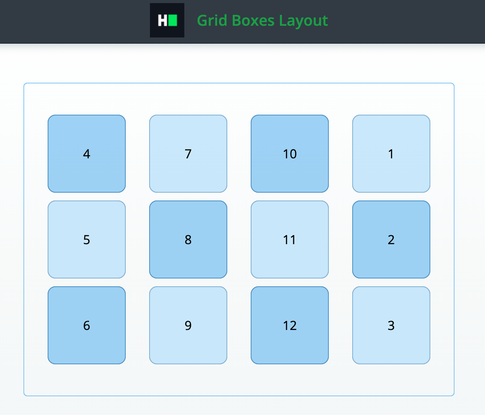

# CSS: Grid boxes layout
Complete a partially completed application. Complete the application shown below using CSS `grid` rules in order to pass all the unit tests.

## Environment 

- Node Version: ^12.18.3
- Default Port: 8000

## Application Demo:


## Application description

Complete a website layout application with the following UI:

Your website contains 12 boxes.
Position all boxes the way described below:
- Layout container should use `display: grid`
- Distance between grid rows should be 10px
- Width of every grid column should be 100px
- Height of every grid row should be 100px
- Grid should be centered vertically within its container
- Grid should justify all blocks within its container with the even spacing
- Blocks with indexes 1, 2 and 3 should be located at the end of the grid (last column)
- Every layout component should be located exactly how it is shown on the template.

All the markup for the question has been added. As a candidate, you have to complete the CSS file to implement the above-stated features.

## Project Specifications

**Read Only Files**
- `test/*`
- `src/index.js`
- `src/index.html`
- `src/css/readonly.css`
- `app.js`

**Commands**
- run: 
```bash
npm start
```
- install: 
```bash
npm install
```
- test: 
```bash
npm test
```
